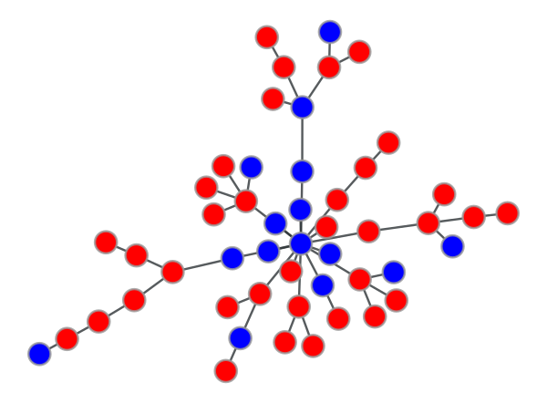
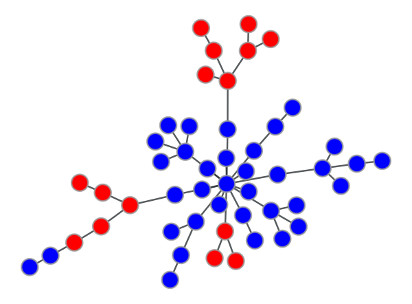
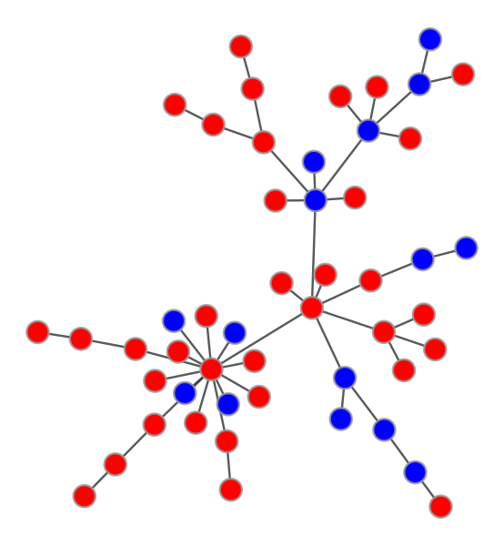
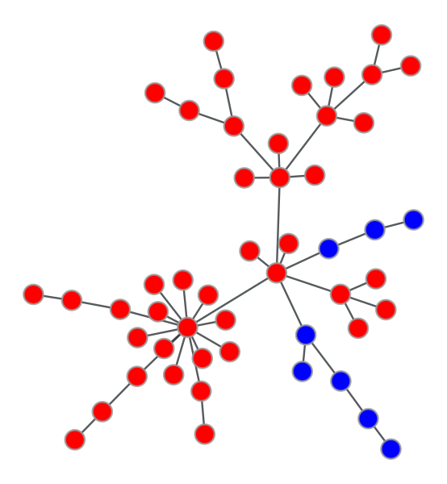
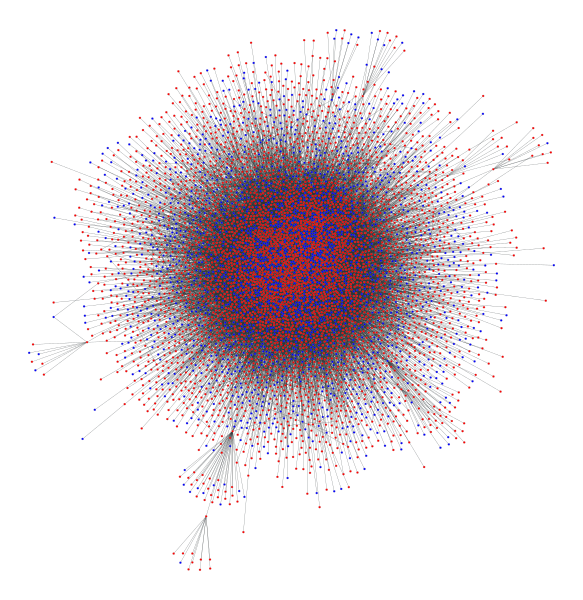
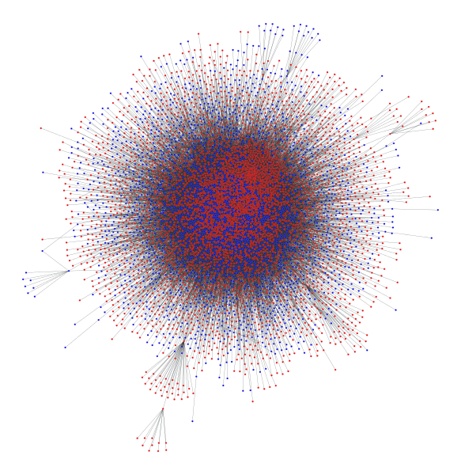
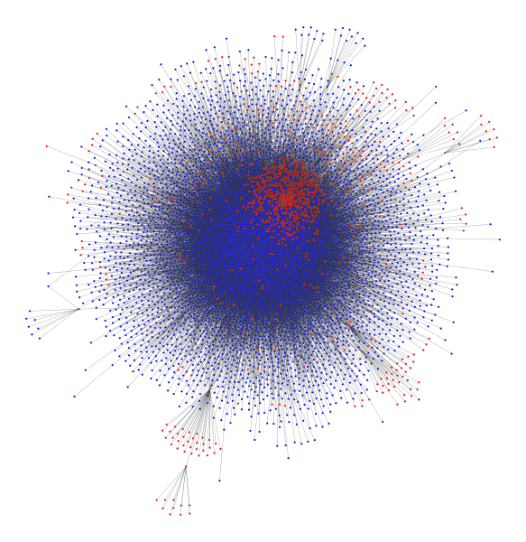
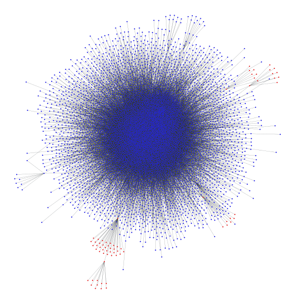

**Matteo Benzi** — S4376824

# 3rd assignment report

To play with the social contagion I use this payoff matrix:

| |**red** |**blue**|
|:-:|:-:|:-:|
|**red** |`1.0`|`0.0`|
|**blue**|`0.0`|`1.75`|

which means that is convenient to adopt the blue idea if the red neighbor is less than 2/3.
> To give an idea `q ~= 0.64` which is less than `2/3 ~= 0.67` and higher than `3/5 = 0.6`

Then I randomly initialize the node adoption to reach **70% red** and **30% blue**.

## Contagion trough random graph

> price model, 50 nodes, undirected

 

As we can see, the majority of the nodes adopts the blue idea, thanks also to some lucky positions: for example their positioning conquer the center of this graph, helping a lot in the spread. This behavior is expected due to the good `q` and because of **the network model, which create hubs but not cliques**. So it's not particularly resistance to social contagion.

However, an unlucky positioning cause a completely different result:

 

So the network with this parameters (15 starting blue nodes and `q~=0.64`) can generates more or less any kind of result, in many cases also a tie between red and blue.

Changing the value of `q` the result doesn't change so much, of course the probability to successfully spread the blue idea to all the network is directly proportional to `q`, but with this model **the number of nodes and those initial positions have the greatest influence.**

> For example using a higher `q` (~= 0.69) but starting with 10 blue nodes instead of 15, can easily generates a final blue adoption less than 20% and it's very hard to surpass the red one.

## Contagion trough the p2p-Gnutella network (_undirected_)

The original graph is directed, but to have a better comparison with the previous one, I decided to start interpreting it as undirected.

 
 

Using the same payoff matrix on the real network **shows similarities with the random one**, but on average is easier to spreads an idea to the whole network.

| _node adoptions_ |**before**|**after**|
|:-:|:-:|:-:|
|**red**|`70%`|`1%`|
|**blue**|`30%`|`99%`|

A difference between the random network is that **it's more sensible to the value of `q`** and it's much harder to generates a tie between red and blue nodes. Again with the real one increasing and decreasing the number of initial nodes changes the result by a lot.

Also this network doesn't have much cliques, so it's expected that this haven't any particular resistance, but an interesting aspect is that in the random one there's a relatively large range in where the adoption can easily stuck in a 50-50, but with the real one this area seems not present.
Instead **in this network there is a tendency to follow all the same idea.** So if an idea reaches enough nodes this will be adopted by the great majority of the nodes.

So it's both easy and difficult spread a new idea because an high number of initial nodes and a convenient payoff is needed, but if you have it then the contagion will reach more or less any node.

## Contagion trough the p2p-Gnutella network (_directed_)

Trying the same things on the same network but as a directed one shows another interesting aspects:
because of the previous analysis we know that this network have a "strange" out-degree distribution, which means that **there are a set of nodes that influence much more than the others.** Interpreting the graph as undirected this aspect is in some way hidden and mitigated by the fact that you can influence many nodes but you can also being influenced by those nodes, in fact the results is quite different.

Using the original payoff matrix but starting the blue nodes from 20% mainly 2 things can happens:

- The contagion spreads successfully to all the network
- The adoption of the blue idea nearly disappear from the graph

This behavior happens also with other value of `q` near 0.64, so **this network have a "gray area" where the result of a social contagion is uncertain.**

> This uncertainty is present also with a different percentage of starting blue nodes, so it's a behavior that not depends from the parameters of the contagion but it's a property derived from the network.

In the undirected graph there isn't this kind of "gray area", but an area where there isn't a real winner, for example starting with 1900 blue nodes (~30%) some times we will obtain an adoption percentage not far from 30%. So there is a sort of stall in which none the red or the blue idea wins. In the directed graph this stall doesn't exist.

As previously _spoiled_ this behavior is probably caused by the out-degree peak we discovered in the analysis of this graph: **If enough of the starting blue node are the ones with high out-degree, they have a great probability to generate a rapid and definitive spread**, otherwise the blue nodes don't have the strength to spread into the whole network.